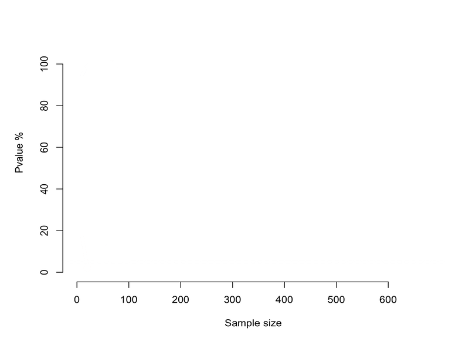

---
output: github_document
---

Welcome to the course on **Introduction to Statistical Thinking** (taught by [Stéphane Guerrier](https://stephaneguerrier.com/)) given within the course *Comprendre le numérique* at the University of Geneva.

# Course material

The linked slides (below) are `.html` files that will only work properly if you are connected to the internet. If you're going off grid, grab the PDFs. You'll miss out on gifs and videos, such as

or

but the rest will actually show up. These slides were mainly prepared by [Gaetan Bakalli](https://gaetanbakalli.com/), [Stéphane Guerrier](https://stephaneguerrier.com/) and [Mucyo Karemera](https://mucyo.net/).

*Note:* The slides were created with [`xaringan`](https://github.com/yihui/xaringan/wiki) in [R](cran.r-project.org) and the [template](https://github.com/edrubin/EC607S20) is based on the work of Dr. [Ed Rubin](https://edrub.in)

**[Lecture: Introduction to Statistical Thinking ](https://raw.githack.com/gaetanbakalli/StatThinking/main/slides.html)**
 

**Note formats:** [.html](https://raw.githack.com/gaetanbakalli/StatThinking/main/slides.html) |
[.pdf](https://raw.githack.com/gaetanbakalli/StatThinking/main/slides.pdf) |
[.Rmd](https://raw.githack.com/gaetanbakalli/StatThinking/main/slides.Rmd)
